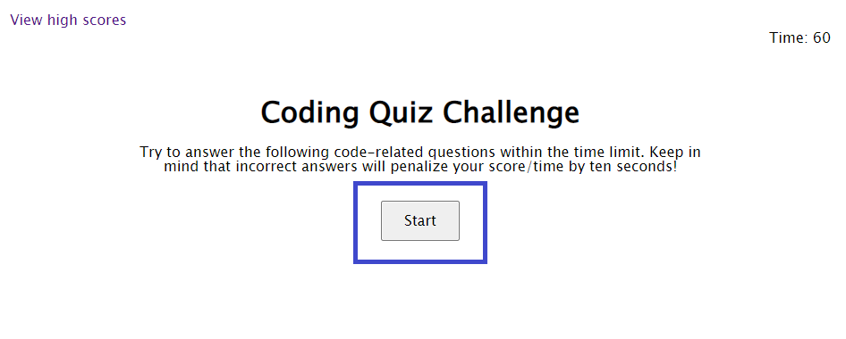
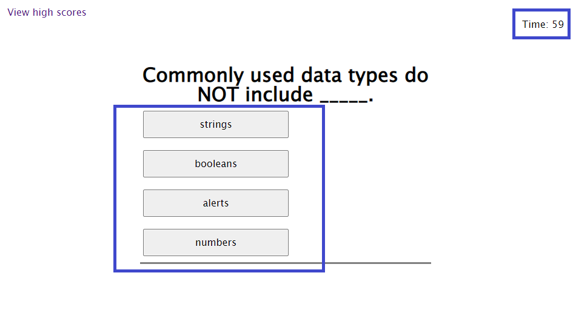
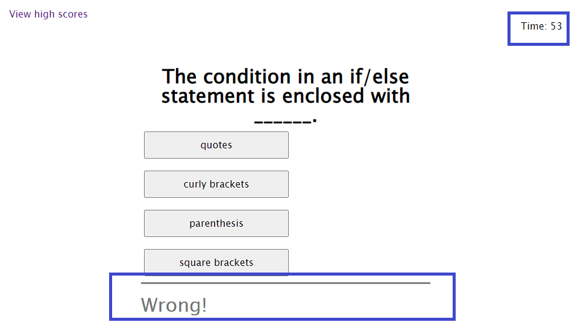
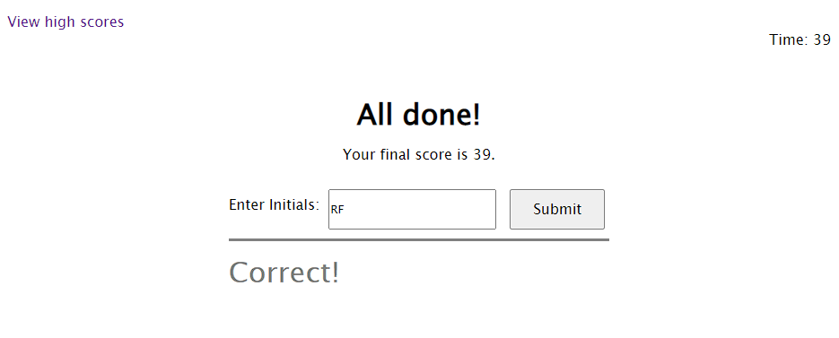
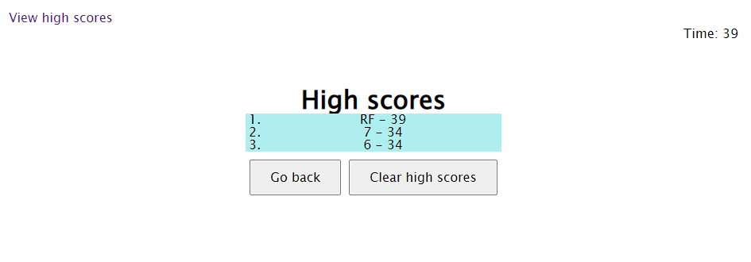

# Code Quiz

## Description

My motivation for this project was to build a Coding Quiz and familiarize myself with basic API concepts. By building this project, I was able to explroe API concepts including: DOM elements, timers, buttons, event listeners, and making changes to an HTML file using JavaScript. This project solves the problem of dynamically removing and adding elements to an HTML file using APIs and the DOM. By completing this project I learned how to use local storage and the DOM.

The deployed application can be found using the following link: https://ryanafernandez.github.io/Code-Quiz/

## Installation

N/A

## Usage

To use this website, the user if first presented with a description of the quiz on the first page. A user can begin the quiz by clicking on the start button.

After clicking the start button, the timer begins to count down from 60 seconds (viewable in the upper-right-hand corner of the screen). The quiz is multiple choice, and the user can select an answer by clicking on their choice.

After selecting an answer, the page will transition to the next questions, and a text element will state if the user's choice was correct. If the user chooses a wrong answer, their remaining time will decrease by 5 seconds.

When all questions have been answered or there is no time remaining, the page will transition to the next screen, presenting the user with their score and a text entry field to enter their initials. The user can click submit to enter their score and name and proceed to the leaderboard screen.

After clicking submit, the user will be presented with the current high scores. The project stores the five highest scores in local storage so that the leaderboard will persist when relaoding the page. There is a link to view the leaderboard in the upper-left-hand corner of the screen that is useable anytime. If the link is used mid-quiz, then the current quiz will be aborted, and the leaderboard displayed.

When ready, the user can then use the "Go back" button to return to the first page and restart the quiz. The "Clear high scores" button can also be used to clear the leaderboard. This will also reset the local storage.

## Credits

N/A

## License

N/A